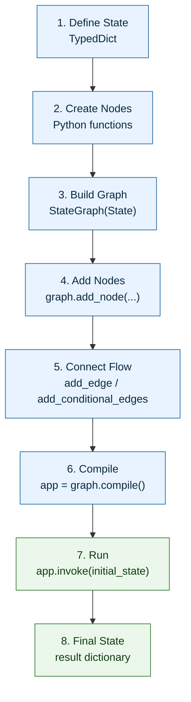
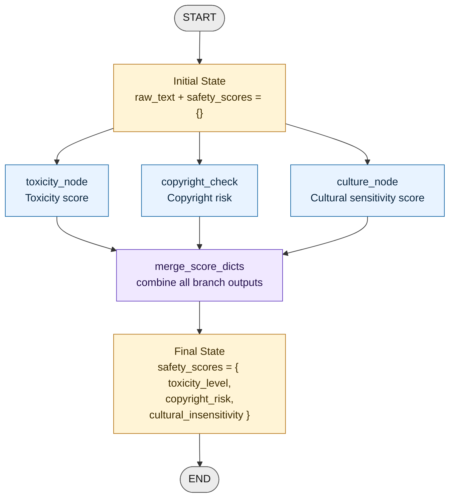
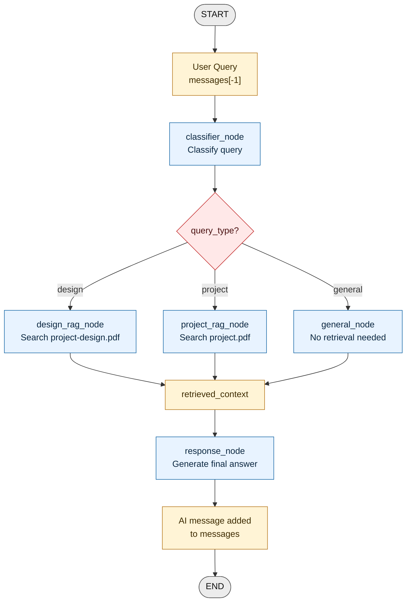
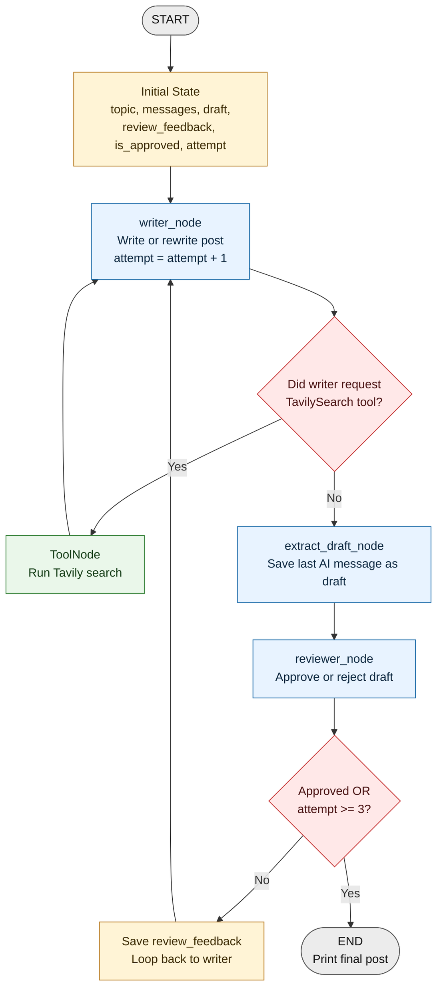

# Onelastdance LangGraph Workflow Diagrams

## Overall LangGraph Pattern

## `project_sequence.py` - Simple Sequential Pipeline

```mermaid
flowchart LR
    START(["START"]) --> I["Initial State<br/>raw_input"]
    I --> E["editor_node<br/>Fix grammar and tone"]
    E --> ET["State update<br/>edited_text"]
    ET --> S["scriptwriter_node<br/>Make YouTube-style script"]
    S --> ST["State update<br/>script_text"]
    ST --> T["translator_node<br/>Convert to Hinglish"]
    T --> FO["State update<br/>final_output"]
    FO --> END(["END"])

    classDef state fill:#fff4d6,stroke:#b7791f,color:#3d2b00
    classDef node fill:#e8f3ff,stroke:#1b6aa8,color:#0b2740
    classDef terminal fill:#ececec,stroke:#555,color:#111
    class I,ET,ST,FO state
    class E,S,T node
    class START,END terminal
```

## `parallel_flow.py` - Parallel Safety Analyzer

## `conditional_flow.py` - Conditional RAG Assistant

## `iterative_tools.py` - Writer, Search Tool, Reviewer Loop

